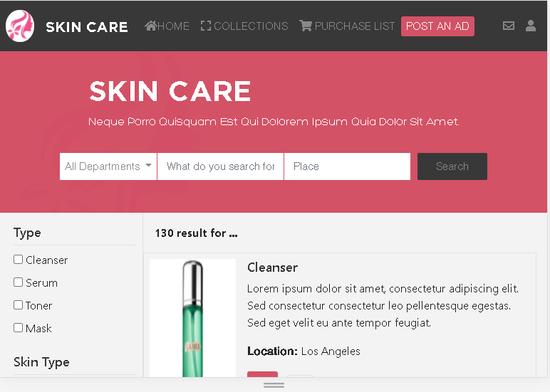

## SkinCare products
Find any skincare product online.

# Description
The Capstone Project Aim is to Create a Shopping site, based on a specific design but giving it personalized content, in this case, it is a store of skincare products. This project consists of a Main and Search Page including goods and respective messages along with prices, The page works best in Chrome, It includes HTML CSS and Bootstrap.

### Desktop Screen


### Tablet Screen


### Mobile Screen


## Built With

- HTML5
- CSS
- Bootstrap
- Font Awesome
- Google Fonts

## Live Demo

[Live Demo Link](https://marilirulita.github.io/capstone-html-css/.)


## Getting Started
To get a local copy up and running follow these simple example steps.

### Prerequisites
- Live Server plugin for Visual Studio Code

### Setup
1. Clone the repository

```
https://github.com/DsunilK/zattix-electronics.git
```

2. Open the folder on VS Code, right click the index.html file and click on "Open With Live Server"

3. Everything should be running by now.

## Author

👤 **Mar y Sol Bautista**

- GitHub: [@marilirulita](https://github.com/marilirulita)
- Linkedin: [@marilirulita](https://www.linkedin.com/in/mar-y-sol-bautista-5a6894151/)
- Twiter: [@marilirulita](https://twitter.com/marylirulita)

## Acknowledgments

- Design by [Mohammed Awad on Behance](https://www.behance.net/M_Awad)
- You can find the original project [Here](https://www.behance.net/gallery/24796463/ZATTIX)

## 🤝 Contributing

Contributions, issues, and feature requests are welcome!

Feel free to check the [issues page](https://github.com/marilirulita/capstone-html-css/issues).

## Show your support

Give a ⭐️ if you like this project!

## 📝 License

This project is [MIT](LICENSE) licensed.
